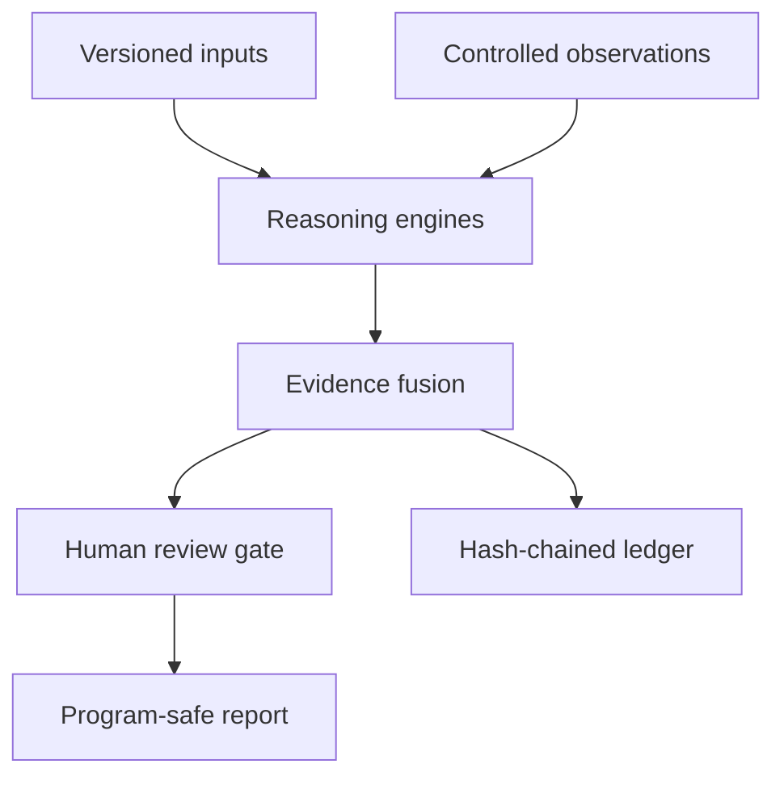

<div align="center">

# BARQ-CRS

### Evidence-gated cyber reasoning, built in Saudi Arabia

[](https://www.python.org/)
[](https://github.com/MEZ111/barq-crs/actions)
[](LICENSE)
[](SECURITY.md)

**Turn versioned code, controlled observations, and state models into a ranked
queue of reproducible security hypotheses.**

</div>

BARQ-CRS is a deterministic research core for authorized bug-bounty programs,
defensive review, and isolated CTFs. It is not another subdomain wrapper. Its
job begins where commodity discovery ends: correlate identity differentials,
API contract drift, patch variants, and state-machine collisions—then preserve
the evidence trail without leaking secrets.

> Current status: research prototype. It finds **candidates**, not guaranteed
> vulnerabilities. Live verification remains a human-approved step governed by
> the target program's written rules.

## Why it is different

| Engine | Input | Signal produced | False-positive control |
|---|---|---|---|
| Authorization differential | Responses from controlled identities | BOLA, role parity, cross-tenant access | Requires matching route/resource and sensitive schema overlap |
| Contract drift | Two OpenAPI versions | Removed auth and new anonymous sensitive routes | Computes effective operation-level security |
| Patch-seeded variants | Security diff + local Python tree | Sibling paths missing the new invariant | AST comparison; no string-only finding |
| State collision | Explicit transition model | Cross-endpoint race candidates | Same resource and same invariant required |
| Signal fusion | Candidates from every engine | Deterministic priority queue | Rewards independent corroboration, not volume |
| Evidence ledger | Sanitized events | Tamper-evident chain | Hash links plus recursive secret redaction |
| SARIF bridge | Ranked candidates | GitHub Code Scanning-compatible output | Emits fingerprints and source locations without raw response data |

## Architecture



The public repository contains deterministic engines, synthetic fixtures, and
tests. Target adapters, credentials, private program scopes, and live campaign
data belong in a separate private repository.

## Install

```bash
git clone https://github.com/MEZ111/barq-crs.git
cd barq-crs
python -m venv .venv
source .venv/bin/activate
python -m pip install -e ".[dev]"
```

Windows PowerShell activation:

```powershell
.venv\Scripts\Activate.ps1
```

## Run the ground-truth demo

```bash
python scripts/benchmark.py
barq authz examples/demo/observations.jsonl
barq drift examples/demo/openapi-before.json examples/demo/openapi-after.json
barq variants examples/demo/security-fix.diff examples/demo/source
barq collisions examples/demo/transitions.json
barq ctf-triage examples/demo/ctf
```

Candidate JSON can be converted to SARIF for a repository's security workflow:

```bash
barq sarif candidates.json barq-results.sarif
```

Expected benchmark output:

```json
{
  "fixture": "barq-ground-truth-v1",
  "counts": {
    "authorization": 3,
    "contract_drift": 2,
    "patch_variants": 1,
    "state_collisions": 1
  },
  "passed": true
}
```

## Scope policy

Every future adapter should load an explicit allowlist like this:

```json
{
  "name": "owned-lab",
  "active_testing": false,
  "human_approval_required": true,
  "targets": [{
    "pattern": "lab.example.test",
    "schemes": ["https"],
    "ports": [443],
    "methods": ["GET", "HEAD", "OPTIONS"],
    "max_rps": 0.5
  }]
}
```

BARQ canonicalizes URLs, rejects implicit targets, blocks destructive path
terms, separates analysis from active testing, and never turns a candidate into
an unattended request.

## Repository map

```text
src/barq_crs/       deterministic engines and CLI
tests/              regression and safety tests
examples/demo/      synthetic ground-truth campaign
scripts/            repeatable benchmark
docs/               architecture, research, and roadmap
```

## Test

```bash
python -m pytest
python scripts/benchmark.py
```

CI runs the suite on Python 3.11, 3.12, and 3.13 with read-only repository
permissions.

## Research basis

BARQ-CRS applies a practical synthesis of AIxCC's hybrid program analysis,
Big Sleep's patch-seeded reasoning, RESTler's stateful dependency model,
single-packet race research, and evidence-gated agent evaluation. The detailed
claims, limitations, and sources are in [docs/RESEARCH.md](docs/RESEARCH.md).

## Responsible use

Use only on systems you own, isolated competitions, or assets covered by
explicit written authorization. Stop when a program's rules prohibit an action.
Do not collect third-party personal data, degrade availability, persist access,
or bypass a human approval gate.

## License

[MIT](LICENSE) © 2026 MEZ111.
