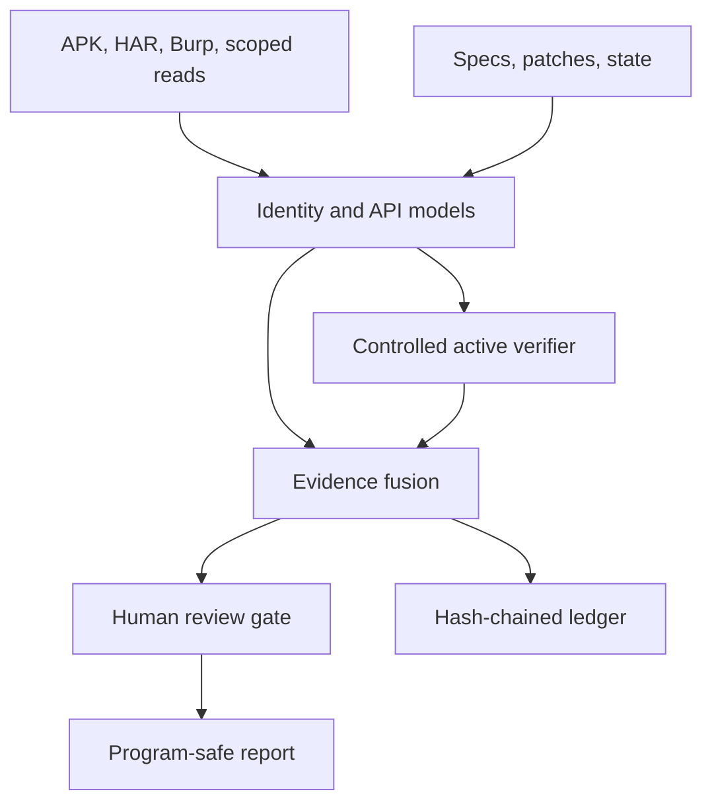

<div align="center">

# BARQ-CRS

### Evidence-gated cyber verification, built in Saudi Arabia

[](https://www.python.org/)
[](https://github.com/MEZ111/barq-crs/actions)
[](LICENSE)
[](SECURITY.md)

**Turn explicitly authorized evidence into ranked hypotheses—and verify
high-value authorization failures with controlled accounts and resources.**

</div>

BARQ-CRS is an operational research core for authorized bug-bounty programs,
defensive review, and isolated CTFs. It analyzes APKs without extracting them,
derives high-value API tests from OpenAPI, imports browser and Burp traffic,
models contract and state changes, and can execute a bounded read-only
authorization matrix across researcher-controlled identities and fixtures.
Credentials and raw protected response values are not written into findings.

> Current status: **v0.4 research system.** Most engines produce candidates;
> the active authorization verifier can additionally mark a finding `verified`
> when controlled differential evidence supports it. No clean result is proof
> that a target is vulnerability-free, and state-changing verification remains
> a human-approved step governed by the target program's written rules.

## Fast path: verify authorization boundaries

For a target you own or are explicitly authorized to test, define an allowlist,
two controlled accounts, controlled resources, and read-only request templates.
Then run:

```bash
export BARQ_ALICE_AUTH='Bearer <controlled-account-token>'
export BARQ_BOB_AUTH='Bearer <controlled-account-token>'
barq verify verification.json --output barq-verification
```

BARQ builds a bounded identity/resource matrix and can verify signals such as:

- non-owner access to another controlled account's object (BOLA/IDOR);
- cross-tenant reads between controlled tenants;
- anonymous access to protected response data;
- low-privilege parity on privileged read routes.

The verifier does **not** enumerate arbitrary identifiers or spray targets. It
only uses explicit resources you supplied, GET/HEAD/OPTIONS requests, the
existing scope allowlist, request/RPS/body/timeout budgets, no redirects, and
blocked destructive paths. See
[active authorization verification](docs/ACTIVE_VERIFICATION.md).

## Why it is different

| Engine | Input | Signal produced | False-positive control |
|---|---|---|---|
| **Active authorization verifier** | Explicit scope + controlled identities/resources + templates/OpenAPI | Evidence-backed BOLA/IDOR, cross-tenant, anonymous and role-boundary findings | Ownership ground truth, read-only matrix, normalized-response comparison, protected-value fingerprints, `verified` vs `likely` strength |
| Android artifact analysis | APK/ZIP or decoded tree | Exported components, deep links, TLS/WebView/storage/release risks, secret fingerprints | Built-in binary AXML decoder, correlated code patterns, no APK extraction, archive budgets |
| OpenAPI test planner | OpenAPI 2/3 schema | BOLA, mass assignment, HPP, type/canonicalization/boundary, replay plans | Deterministic budget, controlled identities, explicit oracles, mutating cases marked isolated-only |
| Scoped collector | Explicit policy + controlled sessions | Live read-only identity matrix | Exact allowlist, no redirects, RPS/body/request budgets |
| Traffic ingestion | HAR or Burp XML | Header-free labeled observations | Ownership and tenant annotations; secrets discarded |
| Authorization differential | Responses from controlled identities | BOLA, role parity, cross-tenant access | Exact normalized response, matching protected values, or strong protected-schema parity; common 2xx denials ignored |
| API dependency graph | OpenAPI schema | Bounded producer/consumer sequences | Reference resolution, normalized binding fields, depth cap |
| Contract drift | Two OpenAPI versions | Auth removal, weaker OR alternatives, removed AND schemes/scopes, sensitive anonymous routes | Preserves effective OpenAPI OR/AND security semantics and does not invent scope hierarchy |
| Patch-seeded variants | Security diff + local Python tree | Sibling paths missing the new invariant | AST comparison; no string-only finding |
| State collision | Explicit transition model | Cross-endpoint race candidates | Same resource and same invariant required |
| Signal fusion | Candidates from every engine | Deterministic priority queue | Rewards independent corroboration, not volume |
| Evidence ledger | Sanitized events | Tamper-evident chain | Hash links plus recursive secret redaction |
| SARIF bridge | Ranked candidates | GitHub Code Scanning-compatible output | Emits fingerprints and source locations without raw response data |
| Campaign orchestrator | Versioned campaign manifest | Report, candidates, test plan, SARIF, summary, evidence ledger | Directory-confined inputs and one reproducible command |

## Architecture



The public repository contains deterministic engines, synthetic fixtures, and
tests. Target adapters, credentials, private program scopes, and live campaign
data belong in a separate private repository.

## Install

```bash
git clone https://github.com/MEZ111/barq-crs.git
cd barq-crs
python -m venv .venv
source .venv/bin/activate
python -m pip install -e ".[dev]"
```

Windows PowerShell activation:

```powershell
.venv\Scripts\Activate.ps1
```

## Run the ground-truth demo

```bash
python scripts/benchmark.py
barq mobile examples/demo/mobile-app
barq api-plan examples/demo/stateful-openapi.json
barq hunt examples/demo/hunt-campaign.json --output barq-output
barq ingest-har examples/demo/traffic-owner.har --principal owner --role user
barq ingest-burp examples/demo/burp-owner.xml --principal owner --role user
barq api-sequences examples/demo/stateful-openapi.json --depth 3
barq authz examples/demo/observations.jsonl
barq drift examples/demo/openapi-before.json examples/demo/openapi-after.json
barq variants examples/demo/security-fix.diff examples/demo/source
barq collisions examples/demo/transitions.json
barq ctf-triage examples/demo/ctf
```

The secret-free active-verification configuration template is in
`examples/authorized-verification/`. The `.test` hostname is intentionally not
a live target.

Candidate JSON can be converted to SARIF for a repository's security workflow:

```bash
barq sarif candidates.json barq-results.sarif
```

Expected benchmark output:

```json
{
  "fixture": "barq-ground-truth-v2",
  "counts": {
    "authorization": 3,
    "contract_drift": 2,
    "patch_variants": 1,
    "state_collisions": 1,
    "har_observations": 1,
    "burp_observations": 1,
    "api_sequences": 1,
    "schema_test_cases": 7,
    "mobile_candidates": 11,
    "campaign_candidates": 18,
    "campaign_artifacts": 6,
    "ledger_valid": true
  },
  "passed": true
}
```

## Verification output

`barq verify` emits seven review artifacts:

- `report.md` — ranked human-readable findings;
- `findings.json` — structured candidates with verification strength;
- `evidence.json` — sanitized observation metadata and fingerprints;
- `verification-plan.json` — the exact bounded read-only plan;
- `results.sarif` — SARIF 2.1.0 output;
- `evidence-ledger.jsonl` — hash-chained evidence events;
- `summary.json` — counts and top findings.

OpenAPI can generate read-only verification templates, but an operation with a
path identifier is live-tested only when that parameter is explicitly mapped to
a controlled resource kind. BARQ skips unresolved routes instead of guessing
identifiers.

## One-command campaign

`barq hunt` accepts a versioned JSON manifest and can combine saved
observations, an explicitly scoped live read-only matrix, OpenAPI versions,
security patches and source, transition models, and an APK/decoded app. It
emits six review artifacts: Markdown, JSON candidates, a schema test plan,
SARIF 2.1.0, a summary, and a verified hash-chained ledger. See
[campaign operations](docs/CAMPAIGNS.md) and [mobile analysis](docs/MOBILE.md).

## Scope policy

Live collection and verification require an explicit allowlist like this:

```json
{
  "name": "owned-lab",
  "active_testing": true,
  "human_approval_required": true,
  "targets": [{
    "pattern": "lab.example.test",
    "schemes": ["https"],
    "ports": [443],
    "methods": ["GET", "HEAD", "OPTIONS"],
    "max_rps": 0.5
  }]
}
```

BARQ canonicalizes URLs, rejects implicit targets, blocks destructive paths,
disables redirects, rate-limits each target, and executes only read-only
methods in the verifier. Credential values are resolved from environment
variables and are not written into observations or reports. See
[authorized operations](docs/OPERATIONS.md).

## Repository map

```text
src/barq_crs/                    deterministic engines, verifier, and CLI
tests/                           regression and safety tests
examples/demo/                   synthetic ground-truth campaign
examples/authorized-collection/  secret-free low-level collection templates
examples/authorized-verification/ secret-free v0.4 verification templates
scripts/                         repeatable benchmark
docs/                            architecture, verification, research, roadmap
```

## Test and release gates

```bash
python -m pytest
python scripts/benchmark.py
```

CI runs Python 3.11, 3.12, and 3.13 and requires correctness linting, mypy on
critical engines, branch coverage of at least 85%, the synthetic ground-truth
benchmark, a package build, CLI smoke tests, and `pip-audit` on Python 3.12.
The v0.4 suite currently contains **119 deterministic tests**.

## Research basis

BARQ-CRS applies a practical synthesis of AIxCC's hybrid program analysis,
Big Sleep's patch-seeded reasoning, RESTler's stateful dependency model,
single-packet race research, and evidence-gated agent evaluation. The detailed
claims, limitations, and sources are in [docs/RESEARCH.md](docs/RESEARCH.md).

## Responsible use

Use only on systems you own, isolated competitions, or assets covered by
explicit written authorization. Stop when a program's rules prohibit an action.
Do not collect third-party personal data, degrade availability, persist access,
or bypass a human approval gate.

## License

[MIT](LICENSE) © 2026 MEZ111.

Release history is documented in [CHANGELOG.md](CHANGELOG.md).
